# sym4delphi
Less or more outdated educational simulations designed for _DELPHI_. From 2000-2010

Most of them are derived from ALGO models and using **unit ALGO** so be carefull :-) - do not use "__Paint image__" & "__Save image__" buttons! It may cause application hang in Windows higher than 98 ;-) 

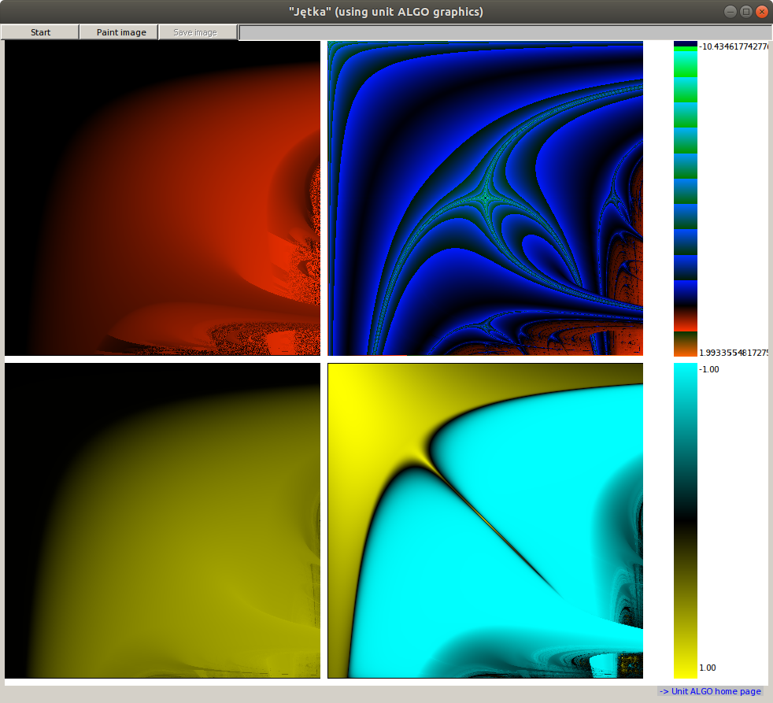
")                                                     
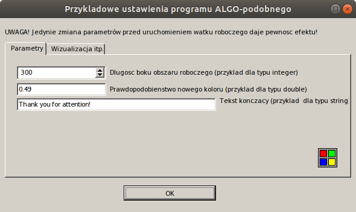                                                     
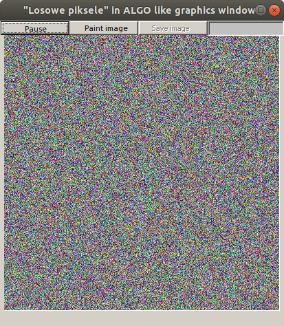                                                   
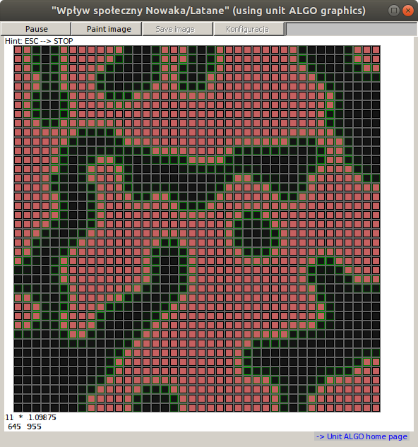                                                                                                                                                                                       
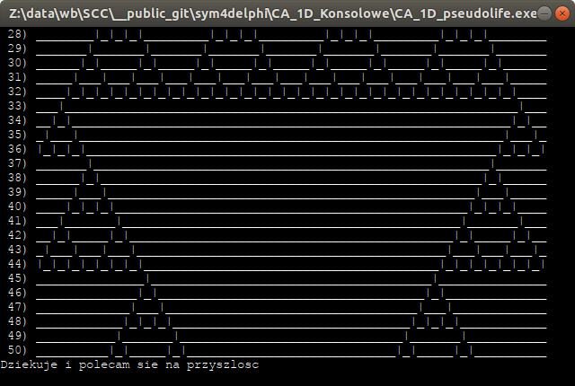 
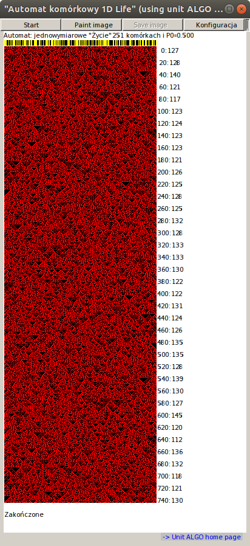                                                                
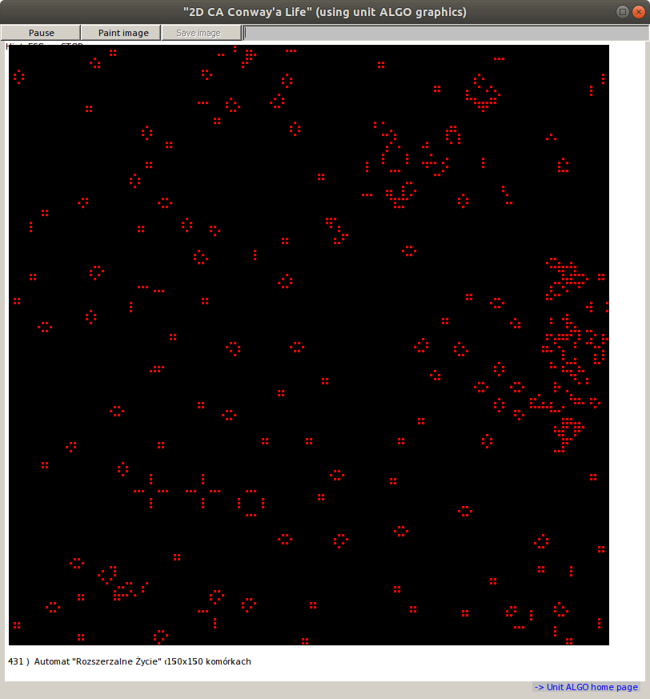   
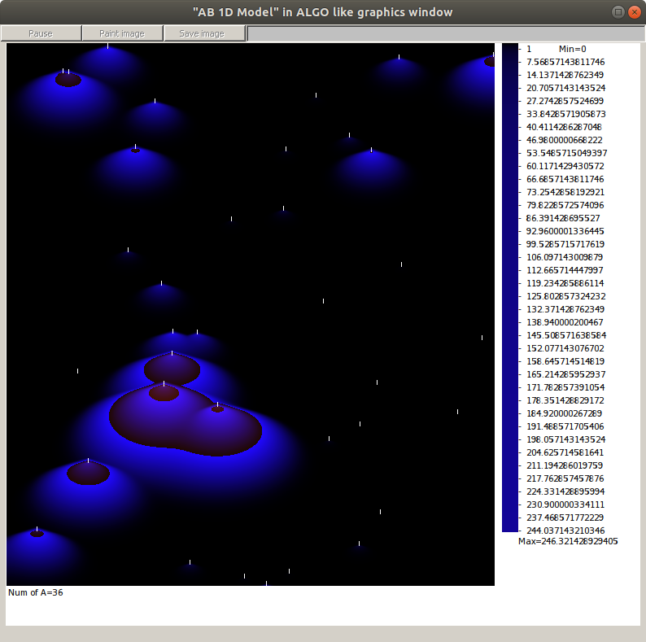                                                                                                                          
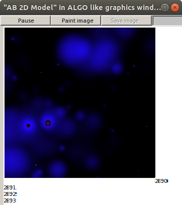
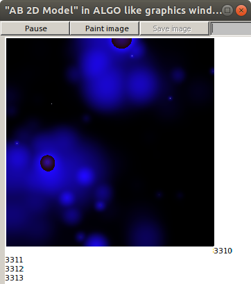
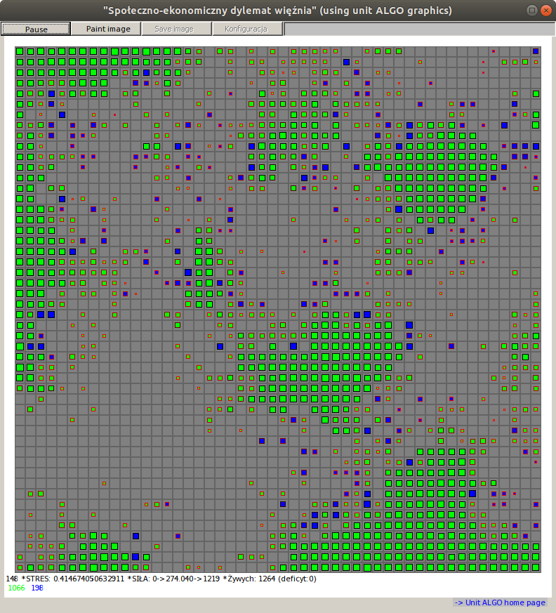
")
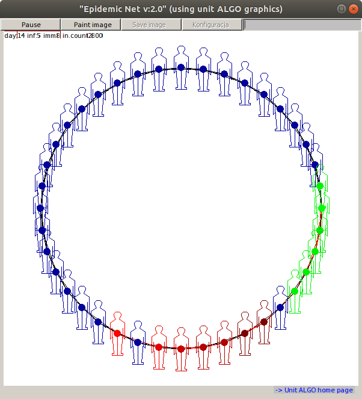      

If you want to compile source codes, **unit ALGO** is currently available here:

https://github.com/borkowsk/sym4delphi/tree/master/UnitAlgo_v2012
