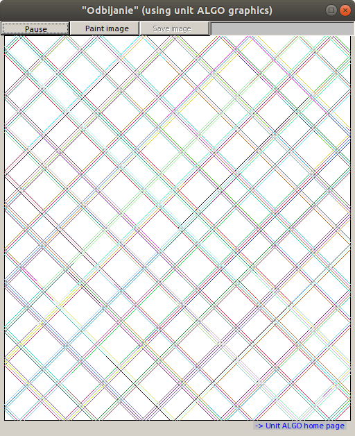
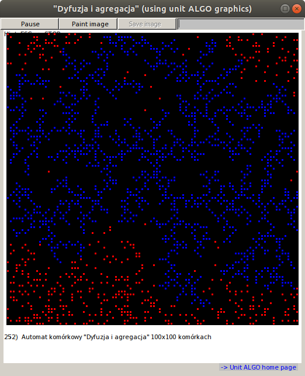

# sym4delphi
Less or more outdated educational simulations designed for _DELPHI_. From 2000-2010

Most of them are derived from ALGO models and using **unit ALGO** so be carefull :-) - do not use "__Paint image__" & "__Save image__" buttons! It may cause application hang in Windows higher than 98 ;-) 

                                                     
                                                     
           
                                             
                                                               
                                                                          
                                                        
 
                                                                
   
                                                                                                                          

   

If you want to compile source codes, **unit ALGO** is currently available here:

https://github.com/borkowsk/sym4delphi/tree/master/UnitAlgo_v2012
